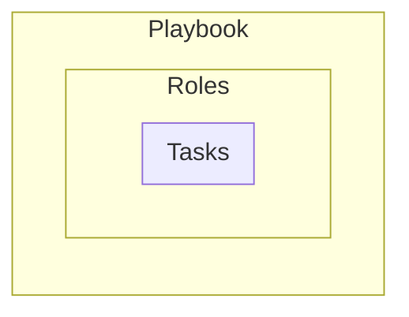

# Автонастройка серверов

- **Inventories** - "кого" настроить (список хостов/серверов)
- **Plugins** - сниппеты кода, расширяющие Ansible
- **Vars** - переменные для обозначения значений для playbook/role/task

# Ссылки
- [Lissy93's ansibles](https://github.com/Lissy93/ansibles)
- [Ansible docs](https://docs.ansible.com/ansible/latest/getting_started/introduction.html)
- [Ansible how to](https://dev.to/lovestaco/getting-started-with-ansible-automate-setups-like-a-pro-5beh)