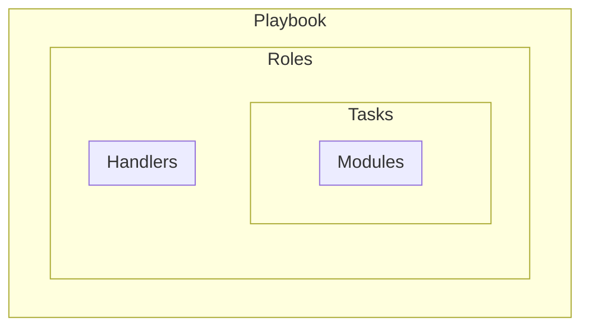
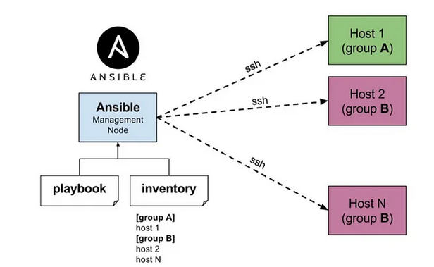

# Ansible automation for Ubuntu/Debian servers


> [Ansible basic concepts](https://docs.ansible.com/projects/ansible/latest/network/getting_started/basic_concepts.html#handlers)

## Setup



### Control node
1. [Check control node requirements](https://docs.ansible.com/projects/ansible/latest/installation_guide/intro_installation.html#control-node-requirements)

2. Setup sudo, non-root user:
```bash
adduser deployer
usermod -aG sudo deployer
```
3. Install Ansible [(how to do it with pipx)](https://docs.ansible.com/projects/ansible/latest/installation_guide/intro_installation.html#installing-and-upgrading-ansible-with-pipx)

4. Setup ssh access to managed nodes:
```bash
ssh-keygen -t ed25519 -a 32 -f ~/.ssh/node1_umrs_backend -C "ansible"
ssh-copy-id -i ~/.ssh/node1_umrs_backend.pub user@node-ip
```
5. Adjust inventory file

6. Test connection to managed hosts:
```bash
ansible all -i inventories/main.yml -m ping
```

### Managed node

- [Managed node requirements](https://docs.ansible.com/projects/ansible/latest/installation_guide/intro_installation.html#managed-node-requirements)


# Subjectively useful resources
- [Ansible docs](https://docs.ansible.com/ansible/latest/getting_started/introduction.html)
- [Ansible how to](https://dev.to/lovestaco/getting-started-with-ansible-automate-setups-like-a-pro-5beh)
