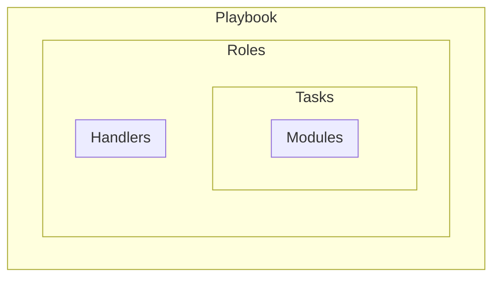

# Ansible automation for Ubuntu/Debian servers


> [Ansible basic concepts](https://docs.ansible.com/projects/ansible/latest/network/getting_started/basic_concepts.html#handlers)

## 🛠️ Setup


### Control node
1. [Check control node requirements](https://docs.ansible.com/projects/ansible/latest/installation_guide/intro_installation.html#control-node-requirements)

2. Setup sudo, non-root user and proceed logged as this user:
```bash
adduser control_user
usermod -aG sudo control_user
```
3. Install Ansible [(how to do it with pipx)](https://docs.ansible.com/projects/ansible/latest/installation_guide/intro_installation.html#installing-and-upgrading-ansible-with-pipx)

4. Setup ssh (no passphrase) access to managed nodes:
```bash
ssh-keygen -t ed25519 -a 32 -f ~/.ssh/node1_umrs_backend -C "ansible" -N ""
ssh-copy-id -i ~/.ssh/node1_umrs_backend.pub user@node-ip
```

5. Adjust hosts and vars files
```ini
[webservers]
playground ansible_host=519.538.204.154 ansible_user=root ansible_port=22 ansible_ssh_pass=some_password
```

6. Test connection to managed hosts:
```bash
ansible playground -m ping
# or more verbosily
ansible all -i inventories/main.yml -m ping
```

7. Install roles and collections
```bash
ansible-galaxy role install -r requirements.yml
ansible-galaxy collection install -r requirements.yml
```

8. Install passlib Python library

### Managed node

- [Managed node requirements](https://docs.ansible.com/projects/ansible/latest/installation_guide/intro_installation.html#managed-node-requirements)


## 🚀 Run
```bash
ansible-playbook playbooks/services.yml
```
For consecutive runs sudo password for new user required along with ssh key access adjustments in hosts file 

```ini
[webservers]
# playground ansible_host=519.538.204.154 ansible_user=root ansible_port=22 ansible_ssh_pass=some_password
playground ansible_host=519.538.204.154 ansible_user=new_user ansible_port=2264984 ansible_ssh_private_key_file=/home/host_user/.ssh/new_setup_private_key
```

and from now on:
```bash
ansible-playbook playbooks/services.yml --become-password-file ~/.ansible/sudo_pass
```

# 📖 Resources
- [Ansible docs](https://docs.ansible.com/ansible/latest/getting_started/introduction.html)
- [Ansible how to](https://dev.to/lovestaco/getting-started-with-ansible-automate-setups-like-a-pro-5beh)
